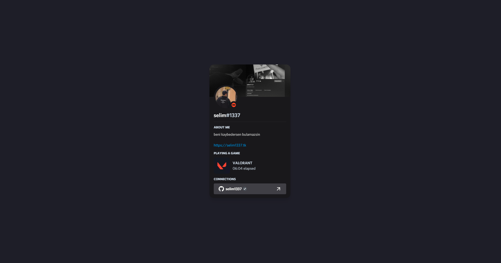

 

# Clover
   


Clover is an open-source personal website and portfolio built with NextJS, Tailwind, Lanyard, and Geist.

## Development Server

Start the development server on http://localhost:5173

```bash
yarn
yarn dev
```

## Production

Build the application for production:

```bash
yarn build
```

To use [Lanyard](https://github.com/Phineas/lanyard), join their server and add your Discord ID on line 52 of `gateway/lanyard.ts`

```sh
export const lanyard = typeof window !== 'undefined' && new Lanyard('PASTE_ID_HERE');
```

More information on Lanyard and how to use it can be found on its repo.

## Attributions

- [Lanyard](https://github.com/Phineas/lanyard) - [@phineyes](https://twitter.com/phineyes)
- [use-lanyard](https://github.com/alii/use-lanyard) - [@alistaiiiir](https://twitter.com/alistaiiiir)


## Meta

Distributed under the MIT license. See ``LICENSE`` for more information.

[https://github.com/selim1337](https://github.com/selim1337)


<!--

-->
